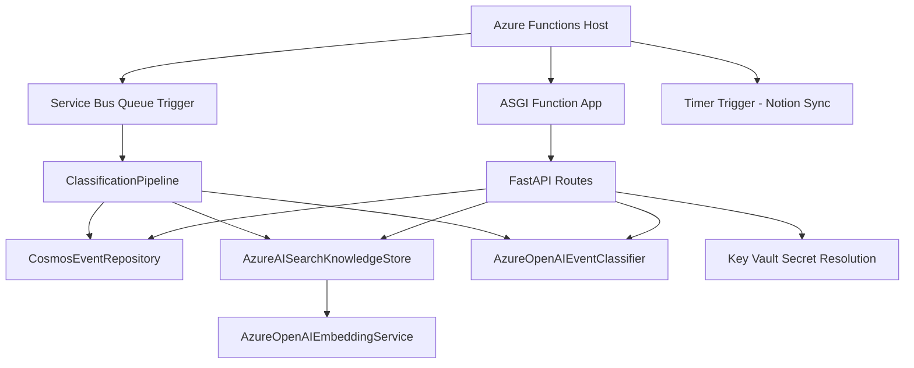
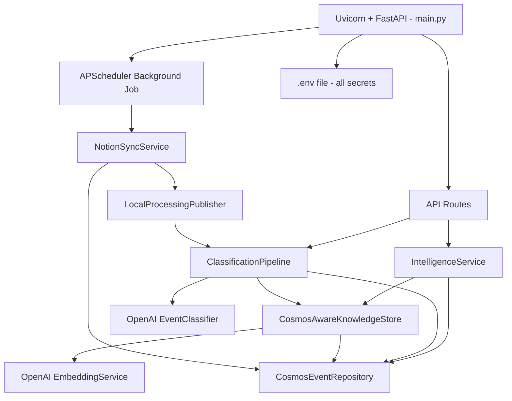

# Migration Plan: From Azure Cloud Services to Standalone FastAPI + Cosmos DB + OpenAI

## Overview

Migrate the ClosedLoop OS project from a heavy Azure cloud services architecture to a lightweight, self-hosted setup. The only Azure service retained is **Cosmos DB** for persistence. All other Azure services are replaced with simpler alternatives.

## Current Architecture (Azure-heavy)



**Azure services currently used:**
- Azure Functions (hosting + triggers)
- Azure Service Bus (async messaging)
- Azure AI Search (vector search + semantic search)
- Azure OpenAI (classification + embeddings)
- Azure Key Vault (secret management)
- Azure Identity (auth for Key Vault)
- Azure Cosmos DB (event + relationship storage)

## Target Architecture (Lightweight)



**Services in new architecture:**
- **Uvicorn** — standalone HTTP server (replaces Azure Functions)
- **Cosmos DB** — retained for event + relationship + vector storage
- **OpenAI API** — standard `openai` Python client (replaces Azure OpenAI)
- **In-memory vector search** — vectors stored in Cosmos DB, loaded into memory for cosine similarity (replaces Azure AI Search)
- **LocalProcessingPublisher** — synchronous in-process pipeline (replaces Service Bus)
- **.env file** — environment variables for all secrets (replaces Key Vault)
- **APScheduler** — background cron for Notion sync (replaces Azure Timer Trigger)

## Detailed File Changes

### 1. `src/closedloop_os/config.py`

**Remove:**
- `azure_search_endpoint`, `azure_search_api_key`, `azure_search_index_name`
- `azure_openai_endpoint`, `azure_openai_api_key`, `azure_openai_deployment`, `azure_openai_embedding_deployment`, `azure_openai_embedding_dimensions`, `azure_openai_api_version`
- `key_vault_uri`, `enable_key_vault_lookup`
- `service_bus_namespace`, `service_bus_queue_name`, `service_bus_connection_string`
- `has_service_bus` property, `has_search` property

**Add:**
- `openai_api_key: str` — standard OpenAI API key
- `openai_model: str` — default `gpt-4o-mini`
- `openai_embedding_model: str` — default `text-embedding-3-small`
- `openai_embedding_dimensions: int` — default `1536`
- `notion_sync_interval_minutes: int` — default `5` for APScheduler
- `has_openai` property — checks if `openai_api_key` is set

**Modify:**
- `load_local_settings()` — keep for backward compat but also support `.env`
- Environment variable names change: `OPENAI_API_KEY`, `OPENAI_MODEL`, `OPENAI_EMBEDDING_MODEL`, `OPENAI_EMBEDDING_DIMENSIONS`, `NOTION_SYNC_INTERVAL_MINUTES`

### 2. `src/closedloop_os/classification.py`

**Remove:**
- `AzureOpenAIEventClassifier` class (uses `AzureOpenAI` client)

**Add:**
- `OpenAIEventClassifier` class — uses standard `openai.OpenAI` client
  - Same prompt and logic, just different client initialization
  - `self._client = OpenAI(api_key=settings.openai_api_key)`
  - `self._model = settings.openai_model`

**Modify:**
- `build_classifier()` — check `settings.has_openai` instead of `settings.azure_openai_endpoint`

### 3. `src/closedloop_os/search.py`

**Remove:**
- `AzureAISearchKnowledgeStore` class (entire Azure Search implementation)
- `AzureOpenAIEmbeddingService` class
- All `azure.search.documents` imports
- `AzureKeyCredential`, `SearchClient`, `SearchIndexClient`, etc.
- `VectorizedQuery` import

**Add:**
- `OpenAIEmbeddingService` class — uses standard `openai.OpenAI`
  - `self._client = OpenAI(api_key=settings.openai_api_key)`
  - `self._model = settings.openai_embedding_model`
  - `embed()` calls `self._client.embeddings.create(model=self._model, input=text)`

- `CosmosAwareKnowledgeStore` class — extends `InMemoryKnowledgeStore` pattern but persists vectors in Cosmos DB
  - On startup: loads all `SearchDocument` records from Cosmos DB into memory
  - On upsert: stores `SearchDocument` in Cosmos DB AND in memory dict
  - On search: uses in-memory cosine similarity (same as `InMemoryKnowledgeStore`)
  - Uses a dedicated Cosmos DB container called `knowledge` for search documents
  - This gives us persistent vector storage with in-memory search speed

**Modify:**
- `build_embedding_service()` — return `OpenAIEmbeddingService` when `has_openai`, else `DeterministicEmbeddingService`
- `build_knowledge_store()` — return `CosmosAwareKnowledgeStore` when `has_cosmos`, else `InMemoryKnowledgeStore`

### 4. `src/closedloop_os/messaging.py`

**Remove:**
- `ServiceBusPublisher` class
- All `azure.servicebus` imports

**Modify:**
- `build_publisher()` — always return `LocalProcessingPublisher` (synchronous in-process processing)
- Remove the `NullPublisher` fallback since `LocalProcessingPublisher` is always available

### 5. `src/closedloop_os/secrets.py`

**Remove:**
- Entire file content — Key Vault is no longer used
- `azure.identity` and `azure.keyvault.secrets` imports

**Replace with:**
- Simple `get_secret()` function that reads from environment variables only
- `def get_secret(name: str) -> str | None: return os.getenv(name)`
- This keeps the API compatible with all existing callers in `api.py` and `notion_sync.py`

### 6. `src/closedloop_os/api.py`

**Remove:**
- All `get_secret` calls that fall back to Key Vault (e.g., `resolve_github_secret`, `resolve_slack_signing_secret`, etc.)
- The `key_vault_lookup` concept from connector status
- `ALLOWED_CONNECTOR_KEYS` should no longer include `ENABLE_KEY_VAULT_LOOKUP`

**Modify:**
- Secret resolution functions simplified: just read from settings/env directly
- `resolve_github_secret()` → `return settings.github_webhook_secret`
- Same pattern for all other secret resolvers
- `_connector_status()` — remove `key_vault_lookup` field
- Add APScheduler startup event in FastAPI lifespan

**Add:**
- FastAPI lifespan handler that starts APScheduler for Notion sync
- Scheduler job that calls `NotionSyncService.sync_updated_pages()` on interval

### 7. `src/closedloop_os/persistence.py`

**Keep:**
- `CosmosEventRepository` — unchanged, this is our primary database
- `InMemoryEventRepository` — keep for fallback/testing
- `EventRepository` ABC — unchanged

**Modify:**
- `build_repository()` — always use `CosmosEventRepository` when `has_cosmos`, else `InMemoryEventRepository`
- Remove `local_runtime_mode` check since we no longer have that concept — just check `has_cosmos`

### 8. `function_app.py`

**Remove:**
- Entire file — Azure Functions is no longer the hosting model
- The `classify_raw_event` Service Bus trigger
- The `sync_notion_pages` timer trigger
- `azure.functions` import

**Note:** This file can be deleted or replaced with a comment pointing to `main.py`

### 9. `main.py`

**Modify:**
- Add APScheduler integration
- On startup: create scheduler, add Notion sync interval job
- Use FastAPI lifespan context manager for scheduler start/stop
- Keep uvicorn as the server

**Add:**
- Import `from closedloop_os.api import app` 
- Mount scheduler lifecycle into the FastAPI app via lifespan
- The lifespan creates an `APScheduler` instance, adds the Notion sync job, starts it on startup, shuts it down on shutdown

### 10. `requirements.txt` and `pyproject.toml`

**Remove:**
- `azure-functions>=1.23.0`
- `azure-servicebus>=7.14.2`
- `azure-search-documents>=11.6.0b12`
- `azure-keyvault-secrets>=4.10.0`
- `azure-identity>=1.23.0`

**Keep:**
- `azure-cosmos>=4.9.0` — still using Cosmos DB
- `openai>=1.99.0` — now using standard OpenAI client
- `fastapi>=0.116.0`
- `uvicorn[standard]>=0.35.0`
- `httpx>=0.28.1`
- `pydantic>=2.11.0`
- `python-dotenv>=1.1.0`
- `mcp[cli]>=1.27.1`

**Add:**
- `apscheduler>=3.11.0` — background job scheduling

### 11. `local.settings.json` / `local.settings.sample.json`

**Remove:**
- `AzureWebJobsStorage`
- `FUNCTIONS_WORKER_RUNTIME`
- `SERVICE_BUS_QUEUE_NAME`, `SERVICE_BUS_CONNECTION_STRING`
- `AZURE_SEARCH_SERVICE`, `AZURE_SEARCH_ENDPOINT`, `AZURE_SEARCH_API_KEY`, `AZURE_SEARCH_INDEX_NAME`
- `AZURE_OPENAI_ACCOUNT`, `AZURE_OPENAI_ENDPOINT`, `AZURE_OPENAI_API_KEY`, `AZURE_OPENAI_DEPLOYMENT`, `AZURE_OPENAI_EMBEDDING_DEPLOYMENT`, `AZURE_OPENAI_EMBEDDING_DIMENSIONS`, `AZURE_OPENAI_API_VERSION`
- `KEY_VAULT_NAME`, `KEY_VAULT_URI`, `ENABLE_KEY_VAULT_LOOKUP`
- All `*_NAME` fields that were Key Vault secret name references

**Keep:**
- `COSMOS_ENDPOINT`, `COSMOS_KEY`, `COSMOS_DATABASE_NAME`, `COSMOS_CONTAINER_NAME`
- All connector secrets: `GITHUB_WEBHOOK_SECRET`, `SLACK_SIGNING_SECRET`, `SLACK_BOT_TOKEN`, etc.

**Add:**
- `OPENAI_API_KEY`
- `OPENAI_MODEL` (default: `gpt-4o-mini`)
- `OPENAI_EMBEDDING_MODEL` (default: `text-embedding-3-small`)
- `OPENAI_EMBEDDING_DIMENSIONS` (default: `1536`)
- `NOTION_SYNC_INTERVAL_MINUTES` (default: `5`)

### 12. New `.env.example` file

Create a clean `.env.example` that documents all required environment variables:

```
# Cosmos DB (required)
COSMOS_ENDPOINT=https://your-account.documents.azure.com:443/
COSMOS_KEY=your-cosmos-key
COSMOS_DATABASE_NAME=closedloop-os
COSMOS_CONTAINER_NAME=events

# OpenAI (required for AI features)
OPENAI_API_KEY=sk-your-openai-key
OPENAI_MODEL=gpt-4o-mini
OPENAI_EMBEDDING_MODEL=text-embedding-3-small
OPENAI_EMBEDDING_DIMENSIONS=1536

# Notion Sync Interval
NOTION_SYNC_INTERVAL_MINUTES=5

# Connector secrets (configure as needed)
GITHUB_WEBHOOK_SECRET=
SLACK_SIGNING_SECRET=
SLACK_BOT_TOKEN=
LINEAR_WEBHOOK_SECRET=
JIRA_ACCESS_TOKEN=
JIRA_WEBHOOK_SECRET=
CONFLUENCE_ACCESS_TOKEN=
CONFLUENCE_WEBHOOK_SECRET=
NOTION_ACCESS_TOKEN=
NOTION_DATABASE_ID=
NOTION_API_VERSION=2022-06-28
ZENDESK_WEBHOOK_SECRET=
```

### 13. Tests

**Modify:**
- All test files that mock `AzureOpenAI` → mock standard `openai.OpenAI`
- Tests referencing `ServiceBusPublisher` → remove or update
- Tests referencing `AzureAISearchKnowledgeStore` → use `CosmosAwareKnowledgeStore` or `InMemoryKnowledgeStore`
- Tests referencing Key Vault → remove those assertions

### 14. `infra/` directory and scripts

**Remove:**
- `infra/main.bicep` — Azure infrastructure deployment template
- `infra/modules/closedloop-resources.bicep` — Azure resources module
- `scripts/azure_prep_checklist.ps1` — Azure setup checklist
- `AZURE_SETUP.md` — Azure setup documentation

**Keep/Modify:**
- `scripts/run_local.ps1` — update to run `python main.py` instead of Azure Functions local host
- `scripts/setup_local.ps1` — update to set `.env` instead of `local.settings.json`
- `scripts/test_all.ps1` — keep as-is (just runs pytest)
- `SETUP_RUN_AND_TEST.md` — update documentation for new architecture
- `LOCAL_QUICKSTART.md` — update for new setup

## Cosmos DB Container for Knowledge Store

The new `CosmosAwareKnowledgeStore` needs a dedicated Cosmos DB container called `knowledge` to store `SearchDocument` records including their `content_vector` field. This container should be created with `/source_tool` as the partition key for efficient queries.

The flow:
1. On `ensure_index()` — load all existing documents from the `knowledge` container into memory
2. On `upsert_event()` — persist the `SearchDocument` to Cosmos DB `knowledge` container AND add to in-memory dict
3. On `semantic_search()` — use in-memory cosine similarity (fast, no network calls)
4. On `find_overlap()` — use in-memory cosine similarity with source filter

This approach gives us:
- **Persistence**: vectors survive restarts (stored in Cosmos DB)
- **Speed**: search is in-memory, no network latency
- **Simplicity**: no separate search service to manage
- **Cost**: no Azure AI Search billing

## Migration Order

1. Config and settings first (foundation)
2. Secrets simplification
3. Classification (OpenAI swap)
4. Search (OpenAI embeddings + CosmosAwareKnowledgeStore)
5. Messaging (remove Service Bus)
6. API (remove Key Vault refs, add APScheduler lifespan)
7. Main entry point (main.py with scheduler)
8. Remove function_app.py
9. Update dependencies (requirements.txt, pyproject.toml)
10. Update config files (local.settings, .env.example)
11. Update tests
12. Clean up infra/ and scripts
13. Update documentation

## Risk Considerations

- **Cosmos DB vector storage**: Storing 1536-dimension float arrays in Cosmos DB items will increase document size. Each vector is ~6KB. With 10K documents that is ~60MB — well within Cosmos DB limits.
- **In-memory search scalability**: Loading all vectors into memory works well up to ~100K documents. Beyond that, consider adding a dedicated vector DB like Qdrant or Weaviate in the future.
- **OpenAI API rate limits**: Standard OpenAI API has rate limits. For high-volume classification, consider batching or queueing.
- **No async messaging**: Removing Service Bus means events are processed synchronously. If webhook throughput becomes an issue, consider adding a local queue (e.g., Redis + Celery) later.